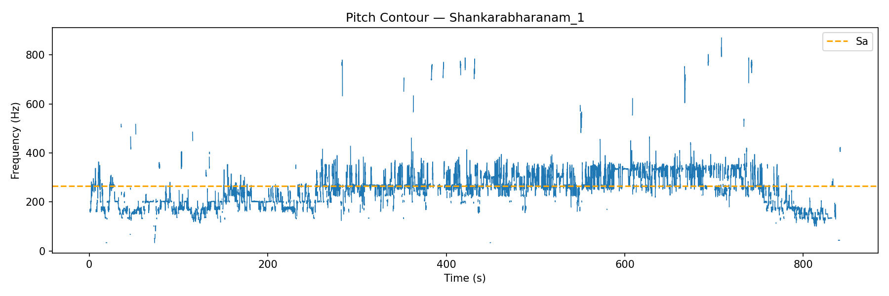
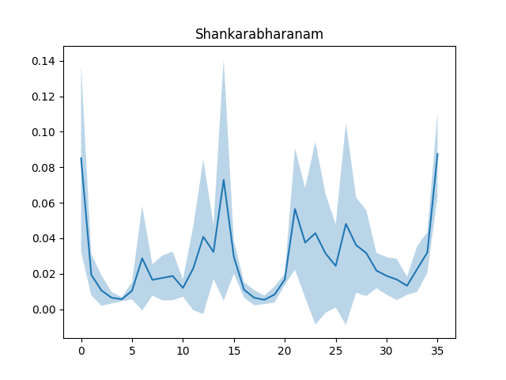
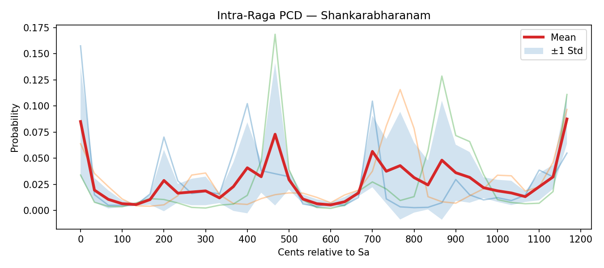

# 🎵 Swarag — Carnatic Raga Identification Engine

Swarag is a deterministic Carnatic raga recognition engine built using interpretable signal processing and structured statistical modeling. It emphasizes explainability, musical grammar, and bias correction over black-box learning.

## 🚀 Version: v1.2

v1.2 introduces:
- Pitch Stability Gating
- Directional Dyads (ascent vs descent)
- Genericness Index penalty
- Versioned aggregation runs
- Reproducible evaluation outputs

## 🧠 Core Philosophy

- Relative pitch, not absolute frequency  
- Behavioral transitions over scale checklists  
- Preserve musical micro-structure  

All modeling is tonic-normalized (Sa).

## 🏗️ Pipeline

**Pitch Extraction**
- `librosa.pyin`
- Automatic tonic estimation
- Stability gating
- Cents normalization

**Feature Modeling**
- Pitch Class Distribution (36-bin)
- Directional dyads (M_up, M_down)
- Laplace smoothing

**Recognition**
- Cosine similarity scoring
- Weighted PCD + Dyad fusion
- Genericness penalty

**Evaluation**
- Per-file diagnostics
- Per-raga accuracy
- Versioned run folders

## 📊 Example Outputs

### 🎼 Pitch Contour

  

### 🎼 Pitch Class Distribution (PCD)

  

### 🎼 Intra-Raga Statistical Profile

  

## 📂 Repository Structure

- `scripts/` — Core engine  
- `docs/` — Documentation & visual assets  
- `notebooks/` — Experimental analysis  

Ignored locally:
- `datasets/`
- `pcd_results/`
- `ML Models/`
- Virtual environments

## ⚙️ Installation

Run:
`pip install -r requirements.txt`

## 🧪 Run Evaluation

From project root:
`cd scripts`
`python batch_evaluate.py`

## 📜 License

MIT License — see `LICENSE`.
