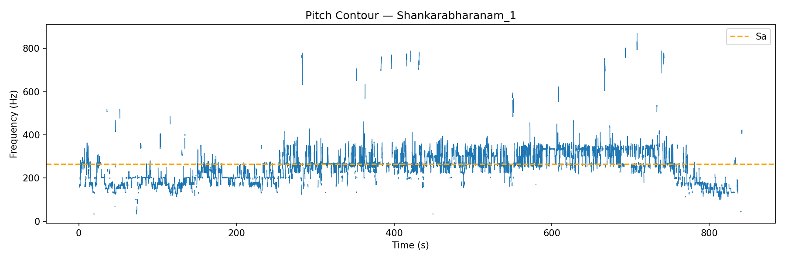
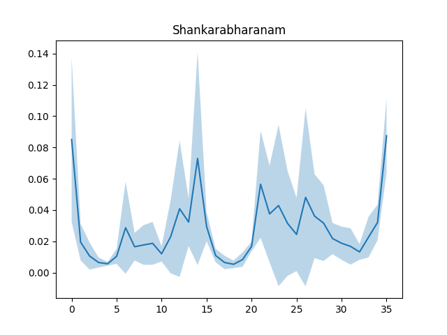
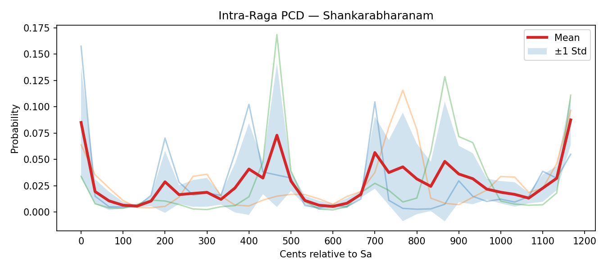

# Swarag -- Carnatic Raga Identification Engine

Swarag is a deterministic Carnatic raga recognition engine built using interpretable signal processing and structured statistical modeling. It emphasizes explainability, musical grammar, and bias correction over black-box learning.

## Version: v1.2.5

v1.2.5 introduces:
- **6 active ragas** with **61 deduplicated clips** (Bhairavi, Kalyani, Shankarabharanam, Mohanam, Thodi, Kamboji)
- **72-bin PCD** -- finer microtonal resolution (was 36-bin), +11.9% accuracy
- **IDF x Variance weighted scoring** -- downweights common bins, upweights distinctive bins
- **ALPHA=0.01** Laplace smoothing fix -- dyad discrimination 1.24x to 1.73x
- **MIN_CLIPS_PER_RAGA=5 guardrail** -- prevents thin-data ragas from poisoning the model
- **Duplicate feature detection and cleanup** -- deduped 81 inflated features down to 68
- **Vocal isolation** requirement -- all training audio is vocal-only
- **LOO cross-validation accuracy: 72.0%** (decided-only, 6 ragas, 61 clips)
- 3 new ragas staged (Abhogi, Madhyamavati, Saveri) -- awaiting more data (need 5+ clips each)

### Version History

| Version | Accuracy | Key Change |
|---|---|---|
| v1.2 | 25% | Baseline (3 ragas) |
| v1.2.1 | -- | 6 ragas, vocal isolation, OOD fixed |
| v1.2.2 | 64% | ALPHA fix (0.5 to 0.01) |
| v1.2.3 | 70% | IDF x Variance PCD weighting |
| v1.2.4 | 78.6% | 72-bin PCD (6 ragas, 53 clips) |
| v1.2.5 | 72.0% | Expanded data (61 clips), dedup, MIN_CLIPS guardrail |

## Core Philosophy

- Relative pitch, not absolute frequency
- Behavioral transitions over scale checklists
- Preserve musical micro-structure
- Vocal-only audio for clean pitch extraction

All modeling is tonic-normalized (Sa).

## Pipeline

```
Audio (.wav / .mp3 / .flac)
  |
  v
Vocal Isolation (Saraga multitrack stems or Demucs htdemucs)
  |
  v
Pitch Extraction (pYIN via librosa, 6-min cap)
  |
  v
Tonic (Sa) Estimation (histogram-based, octave-aware)
  |
  v
Pitch Normalization (cents relative to Sa, folded to 0-1200)
  |
  v
Feature Computation
  |-- PCD: 72-bin pitch class distribution (17 cents per bin)
  +-- Directional Dyads: ascending (mean_up) + descending (mean_down)
  |
  v
Raga Scoring
  |-- IDF x Variance weighted dot-product (PCD + Dyads)
  |-- Weighted fusion (PCD=0.6, Dyad=0.4)
  |-- MIN_CLIPS_PER_RAGA guardrail (excludes thin-data ragas)
  +-- Tiered confidence: HIGH / MODERATE / UNKNOWN
  |
  v
Output: { "final": str, "ranking": list, "margin": float, "confidence_tier": str }
```

## Ragas Currently Modeled

| Raga | Training Clips | Audio Sources |
|---|---|---|
| Bhairavi | 11 | Original seed + Saraga vocal stems + Demucs |
| Kalyani | 14 | Original seed + Carnatic Varnam + Saraga + Demucs |
| Shankarabharanam | 9 | Original seed + Saraga vocal stems + Demucs |
| Mohanam | 11 | Carnatic Varnam + Saraga stems + Demucs |
| Thodi | 11 | Saraga vocal stems + Demucs |
| Kamboji | 5 | Saraga vocal stems + Demucs |

### Staged (awaiting more data, need 5+ clips each)

| Raga | Current Clips | Status |
|---|---|---|
| Abhogi | 2 | Needs 3 more |
| Madhyamavati | 2 | Needs 3 more |
| Saveri | 3 | Needs 2 more |
| Hamsadhvani | 1 | Needs 4 more |

## Example Outputs

### Pitch Contour

<p align="center">
  
</p>

### Pitch Class Distribution (PCD)

<p align="center">
  
</p>

### Intra-Raga Statistical Profile

<p align="center">
  
</p>

## Repository Structure

```
scripts/                        Active v1.2 pipeline
  recognize_raga_v12.py             Inference engine (72-bin, IDF x Variance)
  aggregate_all_v12.py              Build raga models (with MIN_CLIPS guardrail)
  extract_pitch_batch_v12.py        Feature extraction (with 6-min cap)
  batch_evaluate.py                 Evaluation on seed dataset
  batch_evaluate_random.py          Evaluation on unknown clips
  utils.py                          Shared utilities (tonic estimation)
  extract_saraga_vocals.py          Saraga vocal stem extraction
  extract_new_clips.py              Feature extraction for new clips
  run_demucs_batch.py               Demucs batch vocal isolation
  sandbox_*.py                      Phase 2-4 sandbox test scripts
  archive/                          Deprecated pre-v1.2 scripts

.ai/                            AI agent specification
.ai-memory/                     Project memory (bugs, lessons, architecture)
docs/                           Documentation and visual assets
```

Gitignored locally (not in repo):
- `datasets/` -- audio files
- `pcd_results/` -- features, models, evaluations
- `demucs_outputs/` -- vocal separation outputs
- `demucs_staging/` -- files queued for Demucs
- Virtual environments

## Installation

```bash
pip install -r requirements.txt
```

For vocal separation (optional):
```bash
python -m venv demucs_env
demucs_env/Scripts/activate
pip install demucs
```

## Run Pipeline

All scripts are in `scripts/`. Run in this order:

**Step 1 -- Extract pitch features from dataset:**
```bash
python extract_pitch_batch_v12.py
```

**Step 2 -- Aggregate raga signatures:**
```bash
python aggregate_all_v12.py
```

**Step 3 -- Evaluate:**
```bash
python batch_evaluate.py           # on seed dataset
python batch_evaluate_random.py    # on unknown audio
```

> Note: Update `AGG_FOLDER` in batch scripts to point to the latest run folder from Step 2.

## Development

See [DEVELOPMENT.md](DEVELOPMENT.md) for the mandatory development loop, sandbox-first rule, and contribution workflow.

See [CONTRIBUTING.md](CONTRIBUTING.md) for contribution guidelines.

## License

MIT License -- see [LICENSE](LICENSE).
