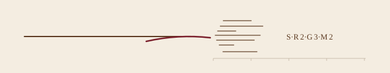

# Swaragam
**Carnatic raga identification through deterministic signal processing.**

Swaragam identifies Carnatic ragas from vocal audio using interpretable signal processing and structured
statistical modeling, emphasizing explainability, musical grammar, and bias correction over black-box learning.

<picture>
  <source media="(prefers-color-scheme: dark)" srcset="docs/assets/swaragam-motif-dark.svg">
  
</picture>

[](PROJECT_STATUS.md)
[](PROJECT_STATUS.md)
[](adr.md)
[](LICENSE)

> **On the name.** The project is **Swaragam**. The repository slug, the virtual environment
> (`my_virtual_env_swarag`) and several tooling identifiers keep the earlier `swarag` spelling — frozen
> technical identifiers, not labels, whose renaming would invalidate documented commands. See `CLAUDE.md` §1a.

## What Swaragam is
A deterministic recognition engine. No neural network, no learned embedding —
every decision traces to a measured pitch distribution and a transition matrix.

- Relative pitch, not absolute frequency
- Behavioral transitions over scale checklists
- Preserve musical micro-structure
- Vocal-only audio for clean pitch extraction

All modeling is tonic-normalized (Sa).

## Research status
**Swaragam is an active research project, not a finished production engine.** Accuracy below is a measured baseline, not a product claim.

| Gate | Question | Status |
|---|---|---|
| Q-001A | Is the representation sufficient for Abhogi? | ANSWERED — adequate; not the bottleneck |
| Q-001B | Do phrase n-grams add power beyond PCD+dyads? | ACTIVE |
| Q-001B-A | Higher-order structure in Abhogi sequences? | COMPLETED — INCONCLUSIVE |
| Q-001B-B | Composition-held-out discrimination? | BLOCKED — only 2 compositional units |
| Q-002 | Would a phrase model improve recognition? | Blocked by Q-001B |
| Q-003 | Is Bhairavi limited by representation or by data? | ACTIVE — UNANSWERED |
| Q-004 | What reproducibility artifact is legally permissible? | Pending |

> **Q-003, the live gate.** Phase 1-A eliminated mean-PCD overlap as the mechanism; Phase 1-B localised the
> failure to the dyad channel; Phase 1-C (complete and independently verified, `9b1dd6d`) found the dyad channel
> explains 3 of Bhairavi's 4 UNKNOWNs and **0 of its 6 wrong answers**, which remain unexplained. Localisation is
> not a diagnosis — the gate is still open. Record:
> [`docs/research/Q-003/PHASE_LOG.md`](docs/research/Q-003/PHASE_LOG.md).

## Pipeline
```
Audio (.wav / .mp3 / .flac)
  |
  v
Vocal Isolation (Saraga multitrack stems or Demucs htdemucs)
  |
  v
Pitch Extraction (pYIN via librosa, 6-min cap)
  |
  v
Tonic (Sa) Estimation (histogram-based, octave-aware)
  |
  v
Pitch Normalization (cents relative to Sa, folded to 0-1200)
  |
  v
Feature Computation
  |-- PCD: 72-bin pitch class distribution (17 cents per bin)
  +-- Directional Dyads: ascending (mean_up) + descending (mean_down)
  |
  v
Raga Scoring
  |-- IDF x Variance weighted dot-product (PCD only)
  |-- Unweighted dot-product (Dyads; up + down averaged)
  |-- Weighted fusion (PCD=0.8, Dyad=0.2; uniform for all ragas)
  |-- MIN_CLIPS_PER_RAGA guardrail (excludes thin-data ragas)
  +-- Tiered confidence: HIGH / MODERATE / UNKNOWN
  |
  v
Output: { "final": str, "ranking": list, "margin": float, "confidence_tier": str }
```

## Validated results
Uniform PCD=0.8 / Dyad=0.2 for all ragas. Canonical v1.3.2 leave-one-out run
(`sandbox_loo_v131_canonical.py`, 70 clips, 25 correct / 14 wrong / 31 unknown, 64.1% decided).

> **Canonical source:** [`PROJECT_STATUS.md`](PROJECT_STATUS.md) -> Current
> Accuracy. The table below is a summary of it. If the two ever disagree,
> `PROJECT_STATUS.md` is correct.

| Raga | Training Clips | Correct | Wrong | Unknown | LOO Accuracy (decided) |
|---|---|---|---|---|---|
| Mohanam | 10 | 1 | 0 | 9 | 100% |
| Saveri | 8 | 7 | 1 | 0 | 88% |
| Shankarabharanam | 9 | 4 | 1 | 4 | 80% |
| Kalyani | 14 | 6 | 2 | 6 | 75% |
| Thodi | 11 | 5 | 2 | 4 | 71% |
| Abhogi | 7 | 1 | 2 | 4 | 33% |
| Bhairavi | 11 | 1 | 6 | 4 | 14% |
| **TOTAL** | **70** | **25** | **14** | **31** | **64.1%** |

### Staged / excluded ragas
"Clips" are distinct eligible source recordings; "Extracted" counts those represented by extracted `.npz` feature files.

| Raga | Clips | Extracted | Status |
|---|---|---|---|
| Kamboji | 3 | 3 | Needs 2+ real clips (Saraga exhausted) |
| Madhyamavati | 2 | 2 | Needs 3 more |
| Hamsadhvani | 1 | 0 | Audio acquired, not yet extracted |

### Version history
| Version | Accuracy | Ragas | Key Change |
|---|---|---|---|
| v1.2 | 25% | 3 | Baseline |
| v1.2.1 | -- | 6 | Vocal isolation, OOD fixed |
| v1.2.2 | 64% | 6 | ALPHA fix (0.5 to 0.01) |
| v1.2.3 | 70% | 6 | IDF x Variance scoring |
| v1.2.4 | 78.6% | 6 | 72-bin PCD |
| v1.2.5 | 72.0% | 6 | Expanded data, dedup, MIN_CLIPS guardrail |
| v1.3 | 58.8% | 5 | Harikambhoji removed, weights 0.7/0.3, honest baseline |
| v1.3.1 | 60.5% | 7 | Abhogi+Saveri activated, 0.8/0.2, Bhairavi override (later confirmed counter-productive) |
| v1.3.2 | 64.1% | 7 | Bhairavi override retired, uniform 0.8/0.2 for all ragas |

> **Caveat.** Pre-v1.3 figures predate the fabrication audit and are **not independently verifiable** —
> historical record, not current accuracy claims. A prior 67.4% figure was found fabricated, its per-raga
> rows never summing to their stated total, and has been retired from all documentation. Only the v1.3.2
> row is canonical.

## Methodology and limitations
> This section exists because the project treats limitations as results.

- **Abhogi 33%** — structural, not tunable. A janya of Kalyani whose PCD is a strict subset; weight
  overrides (L-044) and energy-ratio scoring (L-050) were both tested and rejected.
- **Bhairavi 14%** — cause **UNPROVEN**; representation versus dataset diversity is untested, and "more
  clips" is a hypothesis, not a confirmed diagnosis. *(Correction 2026-08-25: this previously read "needs
  diverse clips". The 14% is FACT; "needs diverse clips" was a HYPOTHESIS stated as a fact.)*
- **Mohanam 100% decided, but 9 of 10 UNKNOWN** — the model barely commits.
- **Kamboji excluded** — 3 real clips, Saraga exhausted, 0 new sources.
- **Saveri is the current error sink** — 8 of 14 wrong answers land there.
- **No OOD score floor.**
- **ADR-016 is unmet** — no `benchmark.py` and no bundled evaluation data, so the one-command
  reproducibility standard remains aspirational.

## Repository navigation
```
scripts/            Active v1.3.2 pipeline, sandbox experiments, archive/
datasets/           Seed corpus, staging, source datasets
docs/               START_HERE.md, ARCHITECTURE.md, research/, assets/, audits
notebooks/          Exploratory notebooks
archive/            Retired material
.ai/                Agent specification
.ai-memory/         Project memory (bugs, lessons, architecture, datasets)
.githooks/          Pre-commit audit hooks

CLAUDE.md           Governance, working rules, environment
PROJECT_STATUS.md   Canonical current state, gates, baseline
adr.md              Architecture decision records
DEVELOPMENT.md      Development loop and sandbox-first rule
CONTRIBUTING.md     Contribution guidelines
requirements.txt    Python dependencies
```

| Read | For |
|---|---|
| [`docs/START_HERE.md`](docs/START_HERE.md) | Navigation and the source-of-truth hierarchy |
| [`PROJECT_STATUS.md`](PROJECT_STATUS.md) | Canonical current state, gates, accuracy |
| [`docs/ARCHITECTURE.md`](docs/ARCHITECTURE.md) | Stable conceptual architecture |
| [`adr.md`](adr.md) | Settled decisions (ADR-001 through ADR-018) |

## Installation and usage
```bash
pip install -r requirements.txt
```
Use the project virtual environment — the bare `python` on PATH is a separate install without numpy and will fail.
```bat
my_virtual_env_swarag\Scripts\python.exe scripts\extract_pitch_batch_v12.py   :: 1. Extract features
my_virtual_env_swarag\Scripts\python.exe scripts\aggregate_all_v12.py         :: 2. Build models
my_virtual_env_swarag\Scripts\python.exe scripts\batch_evaluate.py            :: 3. Evaluate
```
Run from the repository root. The scripts resolve data paths absolutely, so the working directory does not matter, but the interpreter does.

## Research documentation
Research reasoning is not duplicated here — follow the links.

| Document | Contains |
|---|---|
| [`docs/research/Q-003/PHASE_LOG.md`](docs/research/Q-003/PHASE_LOG.md) | Active gate's detailed phase record, append-only |
| [`docs/research/Q-003/RESEARCH_PLAN.md`](docs/research/Q-003/RESEARCH_PLAN.md) | Methodology for the active gate's next phase |
| [`docs/repository-consistency-audit.md`](docs/repository-consistency-audit.md) | Latest repository consistency audit |

## Development and contributing
See [DEVELOPMENT.md](DEVELOPMENT.md) for the development loop and sandbox-first rule, and [CONTRIBUTING.md](CONTRIBUTING.md) for contribution guidelines.
## License
MIT License -- see [LICENSE](LICENSE).
